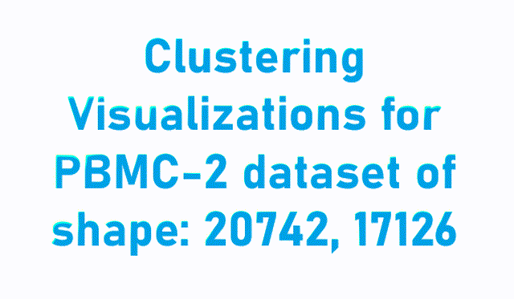

# Interpretable Deep Clustering

<p align="center">

</p>

## An official implementation of the ICML 2024 accepted paper: [Interpretable Deep Clustering for Tabular Data](https://openreview.net/pdf?id=QPy7zLfvof)
<p align="center">

</p>

## UPDATES:

- 2024-10-08: 
    * we add an example notebook that produces a NUDFT plot and compares gated vs non-gated supervised models
    * we present below a fixed figure 4 from the paper: the frequency values are normalized for each model and gated features are used for IDC model rather than raw features.
  

## How to run on your data:

1. Do you have a dataset without labels? Use our colab example notebook: <a target="_blank" href="https://colab.research.google.com/github/jsvir/idc/blob/main/idc_example.ipynb"></a>
2. If you have a labeled dataset, please follow the colab with evaluation example: <a target="_blank" href="https://colab.research.google.com/github/jsvir/idc/blob/main/idc_evaluate.ipynb"></a>


## Fixed Figure 4. Spectral properties of the learned predictive function using ALLAML dataset. 

The model trained with the gating network (IDC) has higher Fourier amplitudes at all frequency levels than
without gates (IDCw/o_gates) the baseline (TELL). This suggests that IDC can better handle the inductive bias of tabular data.
<p align="center">

</p>
### Citation:
Please cite our paper if you use this code:


```

@InProceedings{pmlr-v235-svirsky24a,
  title = 	 {Interpretable Deep Clustering for Tabular Data},
  author =       {Svirsky, Jonathan and Lindenbaum, Ofir},
  booktitle = 	 {Proceedings of the 41st International Conference on Machine Learning},
  pages = 	 {47314--47330},
  year = 	 {2024},
  editor = 	 {Salakhutdinov, Ruslan and Kolter, Zico and Heller, Katherine and Weller, Adrian and Oliver, Nuria and Scarlett, Jonathan and Berkenkamp, Felix},
  volume = 	 {235},
  series = 	 {Proceedings of Machine Learning Research},
  month = 	 {21--27 Jul},
  publisher =    {PMLR},
  pdf = 	 {https://raw.githubusercontent.com/mlresearch/v235/main/assets/svirsky24a/svirsky24a.pdf},
  url = 	 {https://proceedings.mlr.press/v235/svirsky24a.html},
  abstract = 	 {Clustering is a fundamental learning task widely used as a first step in data analysis. For example, biologists use cluster assignments to analyze genome sequences, medical records, or images. Since downstream analysis is typically performed at the cluster level, practitioners seek reliable and interpretable clustering models. We propose a new deep-learning framework for general domain tabular data that predicts interpretable cluster assignments at the instance and cluster levels. First, we present a self-supervised procedure to identify the subset of the most informative features from each data point. Then, we design a model that predicts cluster assignments and a gate matrix that provides cluster-level feature selection. Overall, our model provides cluster assignments with an indication of the driving feature for each sample and each cluster. We show that the proposed method can reliably predict cluster assignments in biological, text, image, and physics tabular datasets. Furthermore, using previously proposed metrics, we verify that our model leads to interpretable results at a sample and cluster level. Our code is available on https://github.com/jsvir/idc.}
}
```


### TODO list:
- [x] Add interpretability evaluation  scripts
- [ ] Add experiments configs
- [ ] Add features index outputs
- [x] Add synthetic dataset deneration code